# ComfyUI CV

Computer-vision nodes for ComfyUI. The pack exposes the functions of the
**OpenCV** library (`cv2`) as nodes — ~470 auto-generated raw `cv2.*` wrappers
plus curated high-level nodes — but it is **not limited to** plain cv2 calls:
a few nodes implement their own algorithm, and not all of cv2 is reachable.
See the disclaimers below for both caveats.

   **This project is an independent, personal endeavor and is not affiliated with, endorsed by, or part of the official OpenCV project. It does not reflect the official roadmap or the views of the OpenCV maintainers. It is provided 'as is', without any express or implied warranties.**

   **"OpenCV" is a registered trademark of the Open Source Vision Foundation — the name as much as the logo. This pack is therefore named *ComfyUI CV*, not after the library, and names OpenCV only to describe what it wraps.**


<details>
<summary> <b>Disclaimers</b> (that you should read) ⬅ click to expand </summary>

<br>

1. **Created with heavy use of Generative AI (LLMs).**
The following models were used: opencode's "*Big Pickle*" stealth models; DeepSeek V4 family; Dots3-Note Preview; Fable 5; Kimi K3; Ling-3.0-flash; Opus family. 

   Besides potential ethical concerns, it also entails the following practical risks:

   - Test‑driven overfitting:
During development, some workflows were developed via a test‑driven approach with sample inputs and outputs. In some cases, the agent generating the code appears to have over‑fitted to the provided examples at the expense of broader correctness. For instance, the 5th and 6th Hu Moments were initially dropped because they were not represented in the test suite. While this specific error was later corrected, it is possible that similar undetected mistakes exist elsewhere in the codebase.

   - Exhaustive input handling:
The "smart" behavior for input types and processing is implemented via exhaustive lists in lowlevel.py. This does not directly affect end‑users, but it may present a maintenance burden for future contributors or for anyone extending the library.

   - Production readiness:
Given the points above, it is not recommended to use this library in production without a thorough, independent review of the used source code. You should verify that all logic aligns with your own requirements, validate with your own test cases, and consider adding additional safeguards.

2. **Updates not planned; may happen at any time.** Do not expect prompt support regarding potential issues/fixes.
3. **Not all OpenCV functionality is exposed.** Despite ~470 auto-generated raw
   `cv2.*` wrappers plus curated nodes, only a subset of cv2 is reachable: the
   generator parses top-level *functions* only, so class-based APIs (`create*`
   factories, detectors, matchers) and complex multi-return functions are absent
   unless a curated node bridges them (see [docs/custom_nodes.md](docs/custom_nodes.md)).
4. **Some low-level nodes cannot run on a given OpenCV distribution.** The node
   registry is generated from whatever the installed build exposes, which can
   include entries whose implementation the build lacks. On the pinned
   reference build, for instance, `ximgproc.fastBilateralSolverFilter` is
   exposed but always raises `(-213) needs to be compiled with EIGEN` when
   executed; another build could surface more or fewer such entries. 
   
   > [!NOTE]  
   > NONFREE entries are not something to go hunting for:
   stock `opencv-contrib-python(-headless)` wheels are built with `OPENCV_ENABLE_NONFREE=OFF`.
   > 
   > **NO shipped workflow uses NONFREE functions.**

5. **DNN support is limited, and ComfyUI often already does
   it better.** Everything here goes through `cv2.dnn` on principle — that is
   the point of the pack — even where ComfyUI has a first-class node for the
   same job. Frame interpolation is the clearest example: core ships
   **"Run Frame Interpolation Model"** (`FrameInterpolate`) plus its loader,
   which run **RIFE and FILM natively in PyTorch**, on the GPU, in fp16, with model
   offloading and a 2–16× multiplier applied across a whole batch. The example workflow for RIFE does it the *heretic* way instead: an ONNX export, driven through the generic
   `cv2.dnn` nodes, **on the CPU, one frame pair per execution**, with the input padded
   to a multiple of 32 by hand. If you actually want to interpolate a video,
   use the core node. Use this one to see how the pieces fit together or to reach
   a model core does not support.

   The same caveat applies to the DNN examples generally. Models that run fine
   in PyTorch had to be converted to ONNX, because that is the format OpenCV's
   DNN module supports — and conversion is sometimes not sufficient: a perfectly valid
   export can still be unloadable here. Support for modern architectures is limited by both the DNN implementation and the pinned OpenCV version.
6. **Models are not bundled.** DNN/LLM workflows need
   external model downloads (`models/onnx`), and some might require conversion into `.onnx` (`.tflite` may also work, I did not test). 

   Model source URLs in the workflow notes.

7. **Raw low-level wrappers are auto-generated and uncurated** — expect to
    handle conversions and edge cases yourself.
8. **The workflows are not production-grade.** They exist mainly to showcase,
    plan and test the functionalities; several pipelines/heuristics are
    overfitted to specific datasets (e.g. the sky mask and stereo settings tuned
    to StereoGeo-CARLA) or may be lacking, so they are not usable in actual
    production contexts. Individual nodes may still be genuinely useful in real
    workflows.
9. **Most nodes are direct `cv2.*` wrappers or high-level compositions of cv2
    calls, but a few are genuine exceptions that reimplement an algorithm
    instead.** `CV Photometric Align (Gain/Bias)` fits a robust per-channel
    gain/bias via trimmed numpy least squares, and `CV Local Linear Fit`
    runs a windowed regression around every pixel; the crop/paste geometry
    (`boxpolicy`/`polytype`) is pure Python + numpy with no cv2 at all. They are
    curated like everything else, but they are not OpenCV functions in the
    wrapper sense (see [docs/custom_nodes.md](docs/custom_nodes.md)).

</details>


<details>
<summary> <b>Gallery</b> ⬅ click to expand </summary>

<br>

<table>
  <tr>
    <td>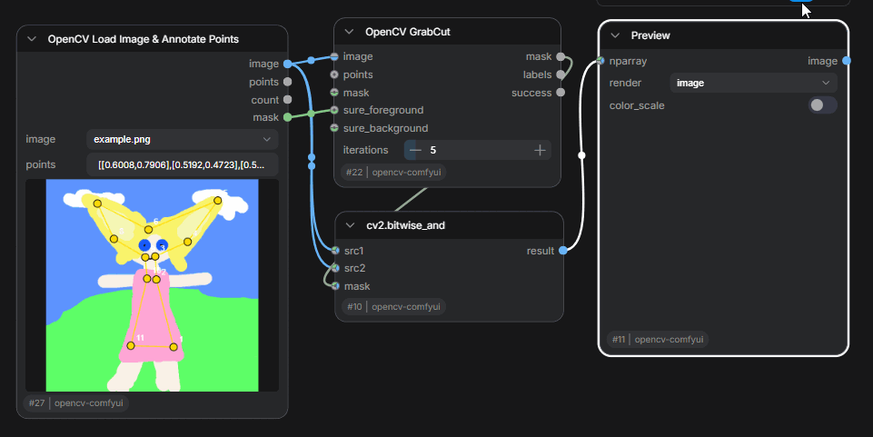</td>
    <td>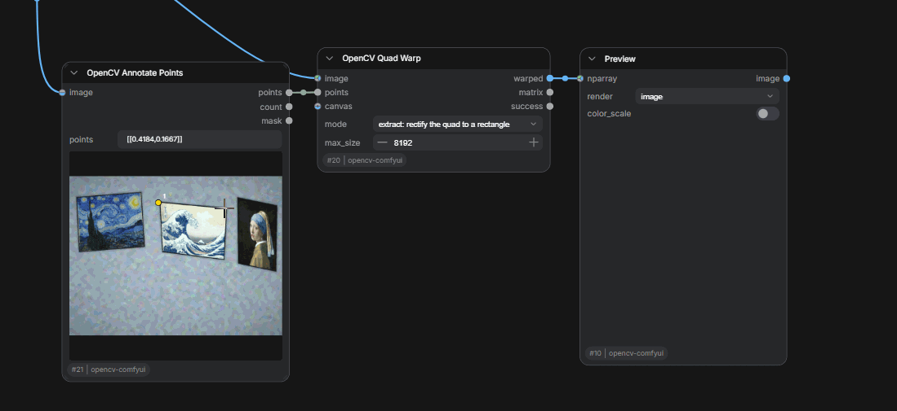</td>
  </tr>
  <tr>
    <td>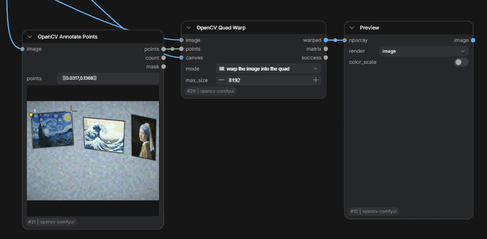</td>
    <td>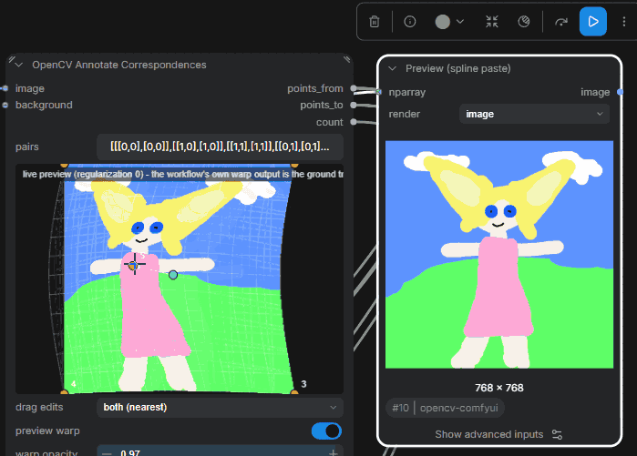</td>
  </tr>
  <tr>
    <td>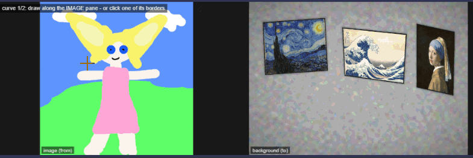</td>
    <td>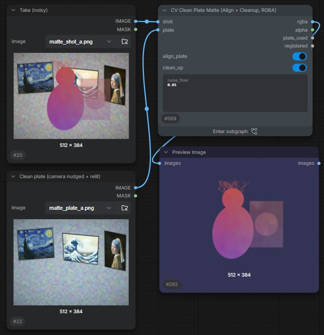</td>
  </tr>
  <tr>
    <td colspan="2">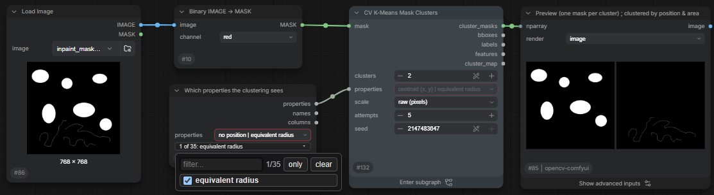</td>
  </tr>
  <tr>
    <td colspan="2">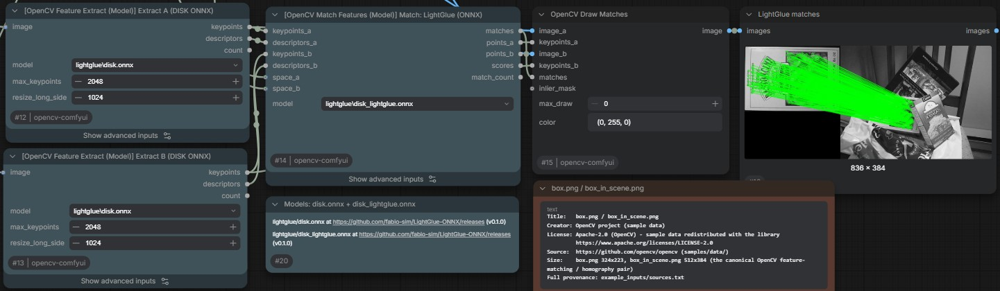</td>
  </tr>
  <tr>
    <td colspan="2">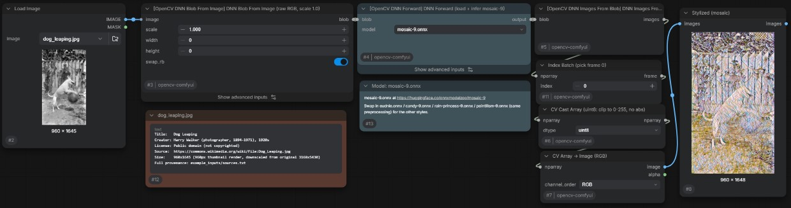</td>
  </tr>
  <tr>
    <td>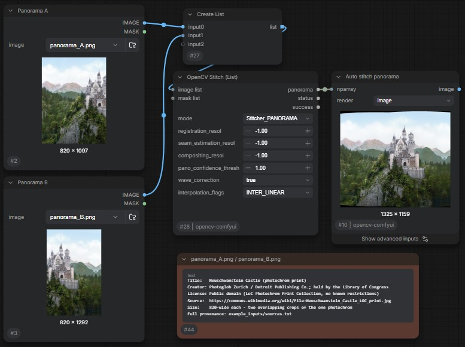</td>
    <td>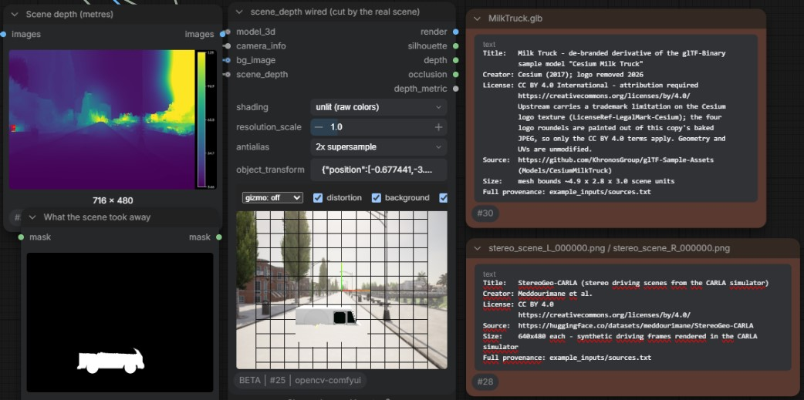</td>
  </tr>
  <tr>
    <td colspan="2">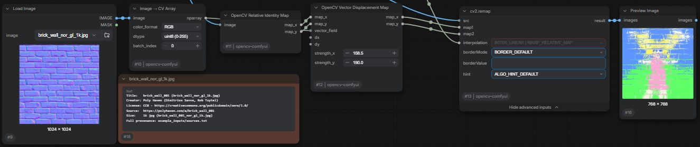</td>
  </tr>
  <tr>
    <td>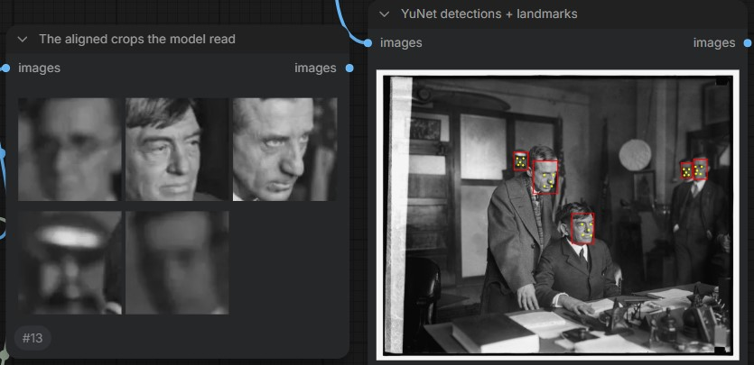</td>
    <td>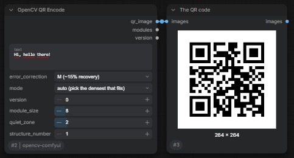</td>
  </tr>
</table>

</details>


<details>
<summary> <b>Installation and Troubleshooting</b> ⬅ click to expand </summary>

<br>

Requires **Python ≥ 3.12** and a recent ComfyUI built on the **V3 node API**.

The only required python dependency can be installed via the pyproject.toml/requirements or with the following command:

```
pip install "opencv-contrib-python-headless~=5.0.0.93"
```

**Behavior is curated against [5.0.0.93](https://pypi.org/project/opencv-contrib-python-headless/5.0.0.93/)**; other versions may behave differently.

The *headless* wheel is the declared dependency because nothing in the pack uses highgui (no `imshow`/`waitKey`/trackbars — the registry generator blacklists them outright). The GUI `opencv-contrib-python` build is equally usable if something else already installed it.

What does matter is **contrib**: installing a non-contrib wheel (`opencv-python` / `opencv-python-headless`) over a contrib one silently empties the contrib submodules and contrib nodes disappear — all four distributions share one `site-packages/cv2`. `tools/repair_opencv_contrib.py` diagnoses (`--check`) and repairs (`--apply`) that, but there is no install-time guard.


Some **workflows and subgraphs** are dependent on other custom node packages, namely:
- Dr.Lt.Data's [ComfyUI-Inspire-Pack](https://github.com/ltdrdata/ComfyUI-Inspire-Pack)
- pythongosssss's [ComfyUI-Custom-Scripts](https://github.com/pythongosssss/ComfyUI-Custom-Scripts)
- StableLlama's [Basic Data Handling](https://github.com/StableLlama/ComfyUI-basic_data_handling)

</details>


<details>
<summary> <b>Get Started</b> ⬅ click to expand </summary>

<br>

### Install the example inputs

The example workflows load their photos, videos and the `MilkTruck.glb` model
from this pack's `example_inputs/` folder. ComfyUI's **Load Image** / **Load
Video** / **Load 3D** nodes are dropdowns, though: they can only offer what is
already inside `ComfyUI/input`, so on a fresh install those nodes open red.

Run **`workflows/01_install_example_inputs.json`** once and the copy is done for
you — it is a single node, **CV Install Example Inputs** (`image/CV`), with
nothing to wire up:

1. Load the workflow and press **Run**.
2. **Reload the ComfyUI page.** The `Load*` dropdowns are built when the node
   definitions are fetched, so files copied during a session only appear after a
   refresh.

Details worth knowing:

- **Nothing is overwritten by default.** `existing_files` starts on *keep the
  file already there*, so a name that already exists in your input folder wins
  and a second run is a no-op (everything comes back as `skipped`). Switch it to
  *overwrite it with the packaged copy* only to repair a sample you edited in
  place.
- **Look before you leap.** Setting `mode` to *list what would be copied (dry
  run)* reports exactly what a real run would do and writes nothing — worth doing
  if your input folder holds work of your own.
- **3D models go to `ComfyUI/input/3d`**, which is the only folder core's Load 3D
  nodes list. Everything else — images, video, and the calibration
  `.json`/`.yaml`/`.csv`/`.txt` sidecars — lands in `ComfyUI/input` itself.
- **Nothing outside `input` is touched, and nothing is ever deleted.** The node
  is failure tolerant: a missing source folder or an unwritable file leaves
  `ok=false` and names the problem in `report` instead of halting the run.

Copying by hand works just as well — `example_inputs/` is ~33 MB of ordinary
files, and `example_inputs/sources.txt` records where each one came from and
under which license.

> [!NOTE]
> The `.onnx` / cascade / LLM / VLM **models** are a separate matter: they are
> not in this repo and not part of `example_inputs`. See `model_sources.txt` at
> the repo root for where to get them.
>
> Two *inputs* do not ship, because of size: the 48 MB driving clip for
> `exercise_visual_odometry_video.json` (its ground-truth poses *do* ship, under
> a non-commercial licence) and the flash / no-flash photo pair in
> `10_ximgproc_edge_aware_filters.json`. Each of those workflows carries a note
> on the canvas explaining where to get them. Everything else a workflow loads is in
> `example_inputs/`, and the development test suite fails if that stops being
> true.

More reading and reference material: [Documentation](#documentation) below.

</details>


<details>
<summary> <b>Documentation</b> ⬅ click to expand </summary>

<br>

| Link | What it is | Open it when |
| --- | --- | --- |
| [Custom nodes](docs/custom_nodes.md) | Catalog of every hand-written node with usage notes and limits | wiring a graph and want a node's intended use |
| [Subgraph blueprints](docs/subgraphs.md) | 65 reusable compositions, each a one-node workflow to open and build around | a step you keep rebuilding — a blueprint may already exist |
| [OpenCV 5.0 documentation](https://docs.opencv.org/5.0/) | Official upstream API reference | using a low-level `cv2.*` wrapper and want the exact signature/edge cases |
| [Model sources](model_sources.txt) | External DNN/LLM models: download URLs, target folders, license record | a model-backed workflow opens red |
| [Example input sources](example_inputs/sources.txt) | Provenance and licenses of the bundled sample media | planning to redistribute outputs or audit assets |

</details>


## Credits 

Gerold Meisinger, the maintainer of [opencv-comfyui](https://github.com/geroldmeisinger/opencv-comfyui) from which this project was forked.

Abhishek Gola, the maintainer of [opencv_contribution](https://huggingface.co/opencv/opencv_contribution) which contains many of the .onnx models showcased in this project and example scripts on how to run them.


## License and provenance

Copyright (C) 2026 bmad4ever. Licensed under [GPL-3.0-only](LICENSE) — every
first-party source file carries an `SPDX-License-Identifier: GPL-3.0-only`
header.

The GPL is *inherited*, not picked: this pack is a fork of
[opencv-comfyui](https://github.com/geroldmeisinger/opencv-comfyui) (GPL-3.0),
which is also where the pack's name, the idea of generating raw `cv2.*` node
wrappers from the type stubs, and the `NPARRAY` socket come from. What ships
today is a rewrite on ComfyUI's V3 node API; the handful of files whose lineage
still runs back upstream — `__init__.py`, `opencv_nodes/convert.py`,
`opencv_nodes/lowlevel.py`, the generated `opencv_nodes/registry*.py`, and
`generator/generator.py` — say so in their own header.

### Bundled third-party code

Not covered by the notice above; each keeps its own license.

| Where | What | License |
|---|---|---|
| `web/lib/` | three.js, plus `GLTFLoader` / `OrbitControls` / `TransformControls` / `BufferGeometryUtils` | MIT — `web/lib/LICENSE.three.txt` |
| `web/lib/` | Apache ECharts | Apache-2.0 — `web/lib/LICENSE.echarts.txt`, `web/lib/NOTICE.echarts.txt` |
| `web/lib/` | KaTeX and its fonts | MIT — `web/lib/LICENSE.katex.txt` |
| `workers/dnn_tasks.py` | the `_MPPalmDet` / `_MPHandPose` classes, ported from the [OpenCV Zoo](https://github.com/opencv/opencv_zoo) `handpose_estimation_mediapipe` reference (upstream models: Google MediaPipe Hands) | Apache-2.0 |
| `workers/stitch_advanced_worker.py` | stage order and parameter set follow OpenCV's own `samples/python/stitching_detailed.py` | Apache-2.0 |
| `opencv_nodes/param_docs.py`, `opencv_nodes/return_docs.py` | per-parameter tooltip text extracted from the OpenCV documentation | Apache-2.0, OpenCV contributors |

OpenCV itself is a **runtime dependency, not bundled**: `cv2` comes from the
`opencv-contrib-python-headless` wheel you install (Apache-2.0), and no OpenCV
binaries ship here.

Image and video assets are recorded in
[`example_inputs/sources.txt`](example_inputs/sources.txt), and the screenshots
and GIFs in this README — with the inputs each one derives from — in
[`docs/sources.txt`](docs/sources.txt). The `.onnx`,
cascade, LLM and VLM **models** are not in this repo at all; their provenance
and licenses are in [`model_sources.txt`](model_sources.txt). Read that file
before redistributing anything you download through it: a few of those models
carry terms stricter than this pack's (notably `yolo26n-seg.onnx`, AGPL-3.0
with a network clause).

**One asset is not under the GPL grant.**
`example_inputs/kitti_2011_09_26_drive_0009_poses.txt` is the KITTI
ground-truth pose track, **CC BY-NC-SA 3.0 — non-commercial**, inherited from
the KITTI benchmark. It is the only non-commercial file in the repository,
included for the visual-odometry example only; the GPL-3.0 grant above does not
extend to it. Remove that one file if you need a uniformly commercial-safe tree.

OpenCV is a registered trademark of the Open Source Vision Foundation. This
pack is an independent, unofficial wrapper, as stated at the top.
